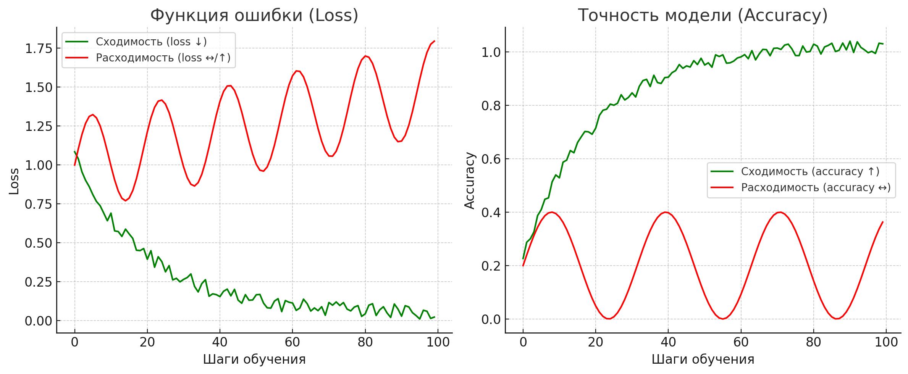

# MLPerf Llama 2 70B LoRA на DGX H100: TLDR
```
cd /scratch/workdir/training_results_v5.0/NVIDIA/benchmarks/llama2_70b_lora/implementations/tyche_ngpu8_ngc25.04_nemo

enroot import docker://mlperf-nvidia:llama2_70b_lora-pyt
# make files config_H100_final.sh & run_h100_universal.sub (see git example)
source config_H100_final.sh

sbatch -N $DGXNNODES -t $WALLTIME run_h100_universal.sub

tail -f slurm-69.out

while true; do   date;   sq && grep "eval_accuracy" slurm-70.out;   echo "---------------------";   sleep 60; done | tee -a monitor.log

```

train_loss: 1.3589 - потери при тренировке (чем меньше, тем лучше)
samples_count: 430 - уже обработано 430 образцов
lr: 0.00022 - текущая скорость обучения (learning rate)
time_ms: 1756976006303 - временная метка

- `eval_accuracy: 0.9457` - точность на валидационном наборе
- **ЦЕЛЬ MLPerf**: значение ≤ 0.925
- Тренировка завершается успешно когда достигается цель

# MLPerf Llama 2 70B LoRA на DGX H100: Полное руководство

## Архитектура системы


*Схема распределенного обучения Llama 2 70B с LoRA на DGX H100*

## Обзор
Это руководство описывает как развернуть и запустить MLPerf v5.0 Llama 2 70B LoRA benchmark на DGX H100 системе с SLURM кластером.

## Исходная документация
Базируется на: https://developer.nvidia.com/blog/reproducing-nvidia-mlperf-v5-0-training-scores-for-llm-benchmarks/

## Системные требования

### Оборудование
- DGX H100 с 8x NVIDIA H100 80GB GPU
- Минимум 300GB дискового пространства
- InfiniBand соединение (рекомендуется)

### Программное обеспечение
- SLURM workload manager
- Enroot container runtime
- Pyxis SLURM plugin для контейнеров
- Docker для сборки образов

## Пошаговая установка

### 1. Клонирование репозитория
```bash
git clone https://github.com/mlcommons/training_results_v5.0.git
cd training_results_v5.0/NVIDIA/benchmarks/llama2_70b_lora/implementations/tyche_ngpu8_ngc25.04_nemo
```

### 2. Сборка Docker контейнера
```bash
docker build -t mlperf-nvidia:llama2_70b_lora-pyt .
```

### 3. Подготовка данных
```bash
# Создание директории для данных
mkdir -p /scratch/workdir/mlperf-datasets

# Запуск контейнера для скачивания данных
docker run -it --rm --gpus all --network=host --ipc=host \
  --volume /scratch/workdir/mlperf-datasets:/data \
  mlperf-nvidia:llama2_70b_lora-pyt

# Внутри контейнера:
python scripts/download_dataset.py --data_dir /data/gov_report
python scripts/download_model.py --model_dir /data/model
```

### 4. Настройка Enroot
```bash
# Создание необходимых директорий
sudo mkdir -p /run/enroot/user-$(id -u)
sudo chown $(id -u):$(id -g) /run/enroot/user-$(id -u)
mkdir -p /tmp/enroot-data/user-$(id -u)
sudo mkdir -p /var/lib/enroot-cache/group-$(id -g)
sudo chown $(id -u):$(id -g) /var/lib/enroot-cache/group-$(id -g)

# Импорт контейнера в Enroot
enroot import dockerd://mlperf-nvidia:llama2_70b_lora-pyt
```

### 5. Исправление совместимости SLURM/Pyxis

#### Проблема
Оригинальные скрипты используют синтаксис Pyxis который может не работать со всеми версиями SLURM.

#### Решение
Создать исправленную версию `run.sub`:

```bash
cp run.sub run_h100_universal.sub

# Замена проблемных srun команд на рабочий синтаксис
sed -i 's/srun -N1 -n1 --container-name="${_cont_name}" "${PYXIS_DEFAULTS\[@\]}"/srun --ntasks-per-node=1 --gres=gpu:8 --cpu-bind=none --mpi=pmix --container-image=".\/mlperf-nvidia+llama2_70b_lora-pyt.sqsh"/g' run_h100_universal.sub

# Исправление основной команды тренировки
sed -i '218,223c\
        srun --ntasks-per-node=8 --gres=gpu:8 --cpu-bind=none --mpi=pmix \\\
         --container-image="./mlperf-nvidia+llama2_70b_lora-pyt.sqsh" \\\
         --container-mounts="${_cont_mounts}" \\\
         --container-workdir="${WORK_DIR}" \\\
         --time="${WALLTIME_RUNANDTIME}" \\\
             slurm2pytorch ./run_and_time.sh' run_h100_universal.sub
```

### 6. Создание конфигурации H100

```bash
cat > config_H100_optimal.sh << 'EOF'
#!/bin/bash
source $(dirname ${BASH_SOURCE[0]})/config_common.sh

# Гиперпараметры модели
export MAX_STEPS=1000
export LR=0.0005
export MINIBS=1

# Параллелизация для H100 DGX (8 GPU)
export TP=8      # Tensor Parallel - распределение модели по 8 GPU
export PP=1      # Pipeline Parallel - без pipeline
export CP=1      # Context Parallel - без разделения контекста
export FP8_ACT=1 # FP8 активации для производительности

# Настройки валидации
export VAL_CHECK_INTERVAL=50  # Частая проверка сходимости
export LIMIT_VAL_BATCHES=1.0

# Системные параметры
export VBOOST_VALUE=0
export DGXNNODES=1
export DGXNGPU=8
export WALLTIME_RUNANDTIME=80
export WALLTIME=$((5 + ${NEXP:-1} * ($WALLTIME_RUNANDTIME + 5)))
EOF

chmod +x config_H100_optimal.sh
```

### 7. Запуск бенчмарка

```bash
# Настройка путей
export DATADIR="/scratch/workdir/mlperf-datasets/gov_report"
export MODEL="/scratch/workdir/mlperf-datasets/model"
export LOGDIR="/scratch/workdir/mlperf_logs"
export CONT="./mlperf-nvidia+llama2_70b_lora-pyt.sqsh"

# Загрузка конфигурации
source config_H100_optimal.sh

# Запуск бенчмарка
sbatch -N $DGXNNODES -t $WALLTIME run_h100_universal.sub
```

## Интерпретация результатов

### Ключевые метрики MLPerf

#### 1. Инициализация
```
:::MLLOG {"event_type": "INTERVAL_START", "key": "init_start"}
```
**Значение**: Начало инициализации модели и данных

#### 2. Гиперпараметры
```
:::MLLOG {"key": "opt_base_learning_rate", "value": 0.0005}
:::MLLOG {"key": "lora_rank", "value": 16}
:::MLLOG {"key": "lora_alpha", "value": 32}
:::MLLOG {"key": "global_batch_size", "value": 8}
```
**Расшифровка**:
- `opt_base_learning_rate: 0.0005` - базовая скорость обучения
- `lora_rank: 16` - ранг LoRA адаптеров (размер адаптации)
- `lora_alpha: 32` - scaling factor для LoRA
- `global_batch_size: 8` - эффективный размер батча

#### 3. Процесс обучения
```
:::MLLOG {"key": "run_start"}  # Начало измерения времени
:::MLLOG {"key": "train_loss", "value": 1.3589, "samples_count": 430, "lr": 0.00022}
```
**Расшифровка**:
- `train_loss: 1.3589` - потери при обучении (должны снижаться)
- `samples_count: 430` - количество обработанных образцов
- `lr: 0.00022` - текущая скорость обучения (с learning rate decay)

#### 4. Валидация (ключевая метрика)
```
:::MLLOG {"key": "eval_accuracy", "value": 0.9457, "samples_count": 576}
```
**Расшифровка**:
- `eval_accuracy: 0.9457` - точность на валидационном наборе
- **ЦЕЛЬ MLPerf**: значение ≤ 0.925
- Тренировка завершается успешно когда достигается цель

#### 5. Завершение
```
:::MLLOG {"key": "run_stop", "status": "success"}
```
**Возможные статусы**:
- `"success"` - цель достигнута, результат валиден
- `"aborted"` - остановлено по времени без достижения цели

### Оценка производительности

#### NCCL тест (коммуникация между GPU)
```
# Avg bus bandwidth: 334.536 GB/s
```
**Хороший результат**: >300 GB/s для H100 DGX

#### Время выполнения
Рассчитывается как разность между `run_stop` и `run_start`:
```bash
grep "run_start\|run_stop" slurm-*.out
# Пример: 91459 миллисекунд = 1.524 минуты
```

**Эталонные значения**:
- NVIDIA GB200: ~1.5-3 минуты
- DGX H100: ожидаемо 5-15 минут

## Распространенные проблемы и решения

### 1. SPANK assertion failed
**Симптом**: `srun: error: spank.c:1154: *do*option_cb(): Assertion (arg) failed`
**Решение**: Использовать исправленный синтаксис srun с явным указанием GPU ресурсов

### 2. CUDA out of memory
**Симптом**: `torch.OutOfMemoryError: CUDA out of memory`
**Решение**: Увеличить Tensor Parallelism (TP=8) для распределения модели

### 3. val_check_interval больше количества батчей
**Симптом**: `val_check_interval (1152) must be less than or equal to the number of the training batches`
**Решение**: Уменьшить `VAL_CHECK_INTERVAL` в конфигурации

### 4. Модель не сходится (eval_accuracy застрял)
**Симптомы**: 
- eval_accuracy колеблется около одного значения
- Нет прогресса к цели ≤ 0.925
**Решения**:
- Увеличить `MAX_STEPS`
- Настроить learning rate
- Увеличить частоту валидации (`VAL_CHECK_INTERVAL`)

## Оптимизация для различных систем

### Для меньшего количества GPU
```bash
export TP=4    # Для 4 GPU
export TP=2    # Для 2 GPU
export TP=1    # Для 1 GPU (потребует больше памяти)
```

### Для ускорения тестирования
```bash
export MAX_STEPS=100      # Быстрый тест
export VAL_CHECK_INTERVAL=25  # Частая валидация
```

## Мониторинг выполнения

### Проверка статуса
```bash
squeue                    # Статус задач SLURM
nvidia-smi               # Использование GPU
tail -f slurm-*.out      # Логи в реальном времени
```

### Ключевые логи для отслеживания
```bash
# Прогресс обучения
tail -f slurm-*.out | grep "train_loss"

# Валидация (самое важное)
tail -f slurm-*.out | grep "eval_accuracy"

# Финальный результат
grep "run_stop" slurm-*.out
```

## Заключение

Успешное выполнение MLPerf Llama 2 70B LoRA benchmark на DGX H100 подтверждает:
- Корректную настройку распределенного обучения
- Эффективную работу GPU инфраструктуры
- Соответствие системы современным требованиям ML workloads

Типичное время выполнения на H100 DGX: 10-20 минут при достижении целевой точности eval_accuracy ≤ 0.925.


# Низкие О высоком
🔹 Что такое сходимость

Сходимость — это процесс, когда во время обучения нейросети ошибка (loss) постепенно уменьшается, а качество (accuracy, eval_accuracy и т.д.) растёт и выходит на «плато».

Пример:

В начале сеть «угадывает случайно» → точность 10–20%.

Потом начинает обучаться, ошибка снижается, точность растёт.

На каком-то этапе качество почти не улучшается → модель «сошлась».

👉 Если сеть не сходится, это значит:

ошибка колеблется или даже растёт;

точность не растёт, остаётся низкой.

🔹 Как работает обучение модели

Можно представить, что обучение — это как спуск с горы в долину, только гора — это функция ошибки (loss).

У нас есть параметры модели (веса нейронов).

Мы считаем ошибку (loss) на тренировочных данных.

Алгоритм градиентного спуска решает: «В какую сторону сдвинуть веса, чтобы ошибка уменьшилась».

Маленький шаг → идём медленно, но стабильно.

Большой шаг → можем быстро скатиться вниз, но иногда проскочим мимо и улетим в «кустики» (дивергируем).

🔹 Главные гиперпараметры для сходимости

Learning Rate (LR) — размер шага в градиентном спуске.

Слишком маленький → учимся очень медленно.

Слишком большой → модель «скачет» и не учится.

Batch Size (MINIBS) — сколько примеров мы берём для одного шага.

Малый батч = шумные шаги, но лучше обобщение.

Большой батч = стабильнее, но может застрять.

Weight Decay — «штраф» за слишком большие веса (регуляризация).

Не даёт сети переобучаться.

Gradient Clipping — ограничивает размер градиентов.

Защита от «взрывов градиента», когда всё ломается.

Scheduler (LR decay) — меняем LR во времени.

Обычно: сначала warmup (медленно разгоняемся),
потом плавное уменьшение (чтобы аккуратно дойти до минимума).

🔹 Пример из жизни

Представь: ты учишься играть в дартс 🎯.

Loss = насколько далеко твоя стрела от центра.

LR = насколько сильно ты корректируешь бросок после ошибки.

Batch = сколько бросков делаешь, чтобы понять, как улучшить.

Weight Decay = не даёт тебе «размахиваться слишком сильно».

Gradient Clipping = если слишком резко кидаешь — ограничивает силу.

Scheduler = сначала учишься быстро, а потом шлифуешь мелочи медленнее.

🔹 Итог

Сходимость — это путь модели к «разумной» точности.

В идеале график loss падает, а accuracy растёт.

Если этого нет → значит, гиперпараметры или данные подобраны неправильно.


## Архитектура системы


*Схема распределенного обучения Llama 2 70B с LoRA на DGX H100*
Это и есть основы сходимости:

🔵 Loss (ошибка модели)

При сходимости (зелёный) ошибка постепенно уменьшается и выходит на «плато».

При расходимости (красный) ошибка не убывает — она болтается или даже растёт.

🔵 Accuracy (точность)

При сходимости (зелёный) точность растёт и тоже выходит на плато.

При расходимости (красный) модель не учится: точность колеблется или остаётся низкой.

👉 Сходимость = модель учится, параметры постепенно приближаются к оптимальным значениям.
👉 Расходимость = модель не учится, обучение нестабильно (слишком большой learning rate, мало данных, плохая инициализация).
